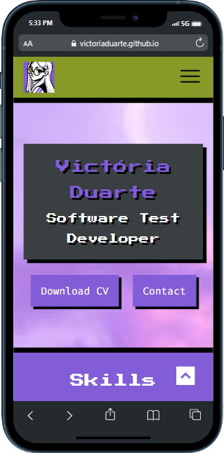
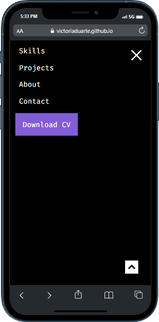

# Portoflio HTML e CSS feliz
 
Project inspired by the course "Portfolio HTML e CSS feliz" on YouTube.

## Live Demo
<strong>https://victoriaduarte.github.io/portfolio-html-css-feliz/</strong>

#### Desktop preview

#### Mobile preview

## What I learned
- CSS Components for scoped styling and easier maintenance
- CSS class variants to change or add style in existing component
- Usage of HTML classes and IDs
- Improvement of semantic HTML and Flexbox knowledge

## Links
- [Figma project](https://www.figma.com/file/GPuzBdwU29g86aSvHm3LXe/Curso-de-HTML-e-CSS-feliz---link-YouTube?type=design&node-id=0-1&mode=design)
- [Course playlist on YouTube](https://www.figma.com/file/GPuzBdwU29g86aSvHm3LXe/Curso-de-HTML-e-CSS-feliz---link-YouTube?type=design&node-id=0-1&mode=design)